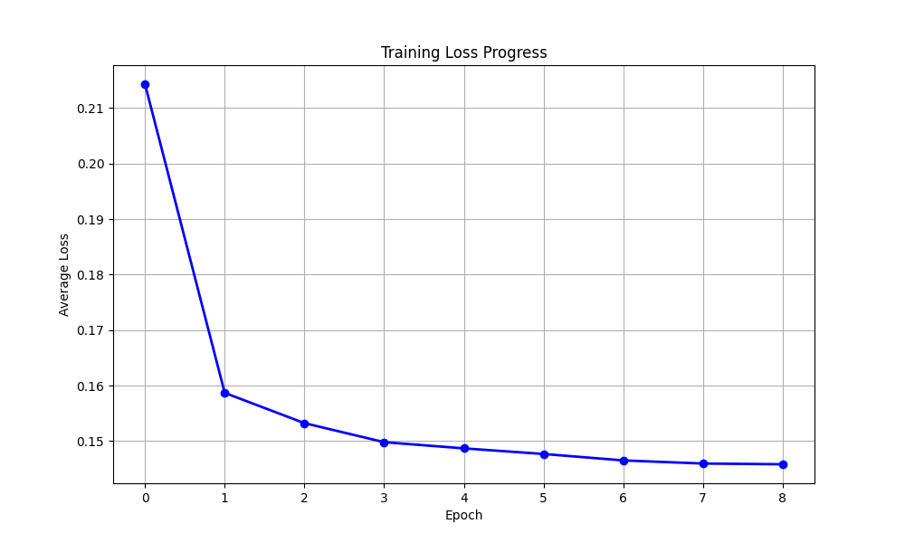
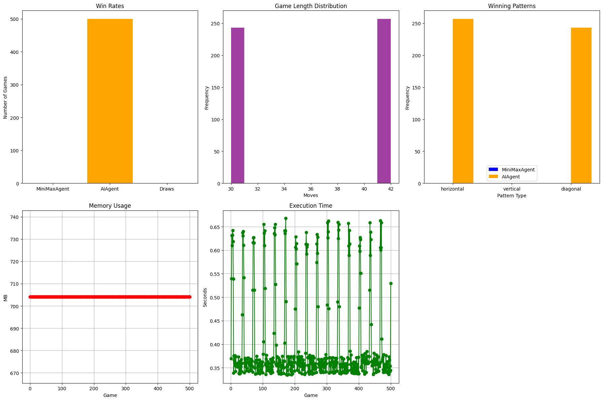
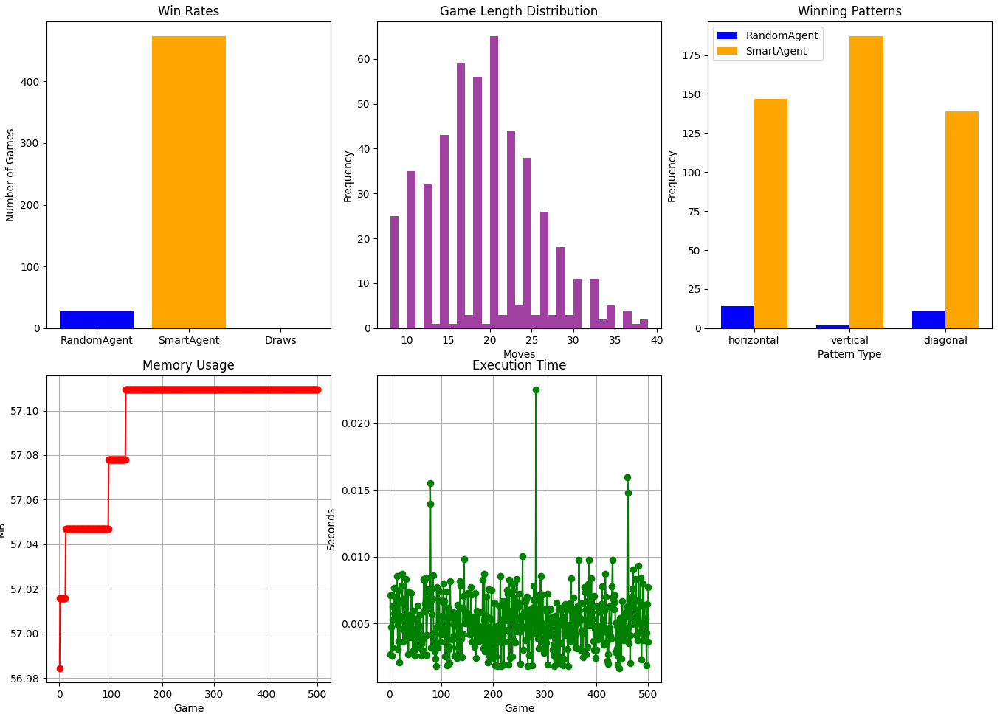
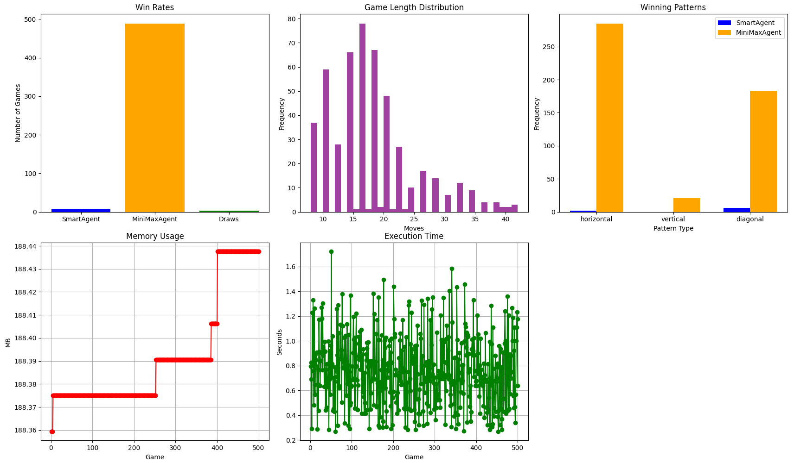

# Connect 4 AI Agents 🤖

Welcome to the **Connect 4 AI Agents** project! This repository contains a collection of AI agents designed to play the classic game of Connect 4. The agents range from simple random decision-makers to more advanced ones like the MiniMax and ML-based agents. Below, you'll find all the necessary information to get started, evaluate the agents, and even play against them!


## 🚀 Getting Started

To get started, clone this repository and ensure you have Python 3 installed. All commands should be executed from the **root directory** of the project.


### 📦 Install Dependencies

First, install the required dependencies using pip:

```sh
pip install -r requirements.txt
```


### 🕹️ Play Against the AI

To play Connect 4 against one of the AI agents, run the following command:

```sh
python3 -m src.play_game
```


### 🧪 Run Tests

We have a suite of tests to ensure everything is working as expected. You can run the tests for each component as follows:

```sh
python3 -m src.test.test_game_board
python3 -m src.test.test_mini_max_agent
python3 -m src.test.test_ml_agent
python3 -m src.test.test_random_agent
python3 -m src.test.test_smart_agent
```


### 📊 Evaluation

To evaluate the performance of the AI agents, navigate to the `src/evaluation/evaluation.py` file. Uncomment the relevant lines for the evaluation you want to run, and then execute:

```sh
python3 -m src.evaluation
```

The evaluation results will include graphs and metrics to compare the agents' performance.


### 📁 Project Structure

Here’s an overview of the project structure:

.
├── .gitignore
├── credits.md
├── readme.md
├── requirements.txt
└── src
    ├── agents
    │   ├── mini_max_agent.py
    │   ├── ml_agent
    │   │   ├── agent.py
    │   │   ├── data
    │   │   ├── model.py
    │   │   ├── pipe
    │   │   │   ├── data_loader.py
    │   │   │   ├── trainer.py
    │   │   │   └── training_data_generator.py
    │   │   └── models
    │   ├── random_agent.py
    │   └── smart_agent.py
    ├── evaluation
    │   ├── evaluation.py
    │   ├── graphics
    │   │   ├── 3d_minimax_vs._ml.png
    │   │   ├── random_vs._smart.png
    │   │   └── smart_vs.3d_minimax.png
    ├── game
    │   ├── board.py
    │   ├── game.py
    │   └── play_game.py
    └── test
        ├── test_game_board.py
        ├── test_mini_max_agent.py
        ├── test_ml_agent.py
        ├── test_random_agent.py
        └── test_smart_agent.py


### 📈 Evaluation Graphs

Here are some key graphs generated during the evaluation:

1. **Training Loss for ML Agent**  
   

2. **Agent Performance Comparisons**  
   - **Minimax vs. ML**  
     
   - **Random vs. Smart**  
     
   - **Smart vs. Minimax**  
     


### 📚 Credits

For a list of resources, libraries, and tools used in this project, check out the `credits.md` file. It includes links and acknowledgments for everything that helped make this project possible.

---

Enjoy playing with and exploring the Connect 4 AI Agents! If you have any questions or suggestions, feel free to open an issue or contribute to the project. 🚀