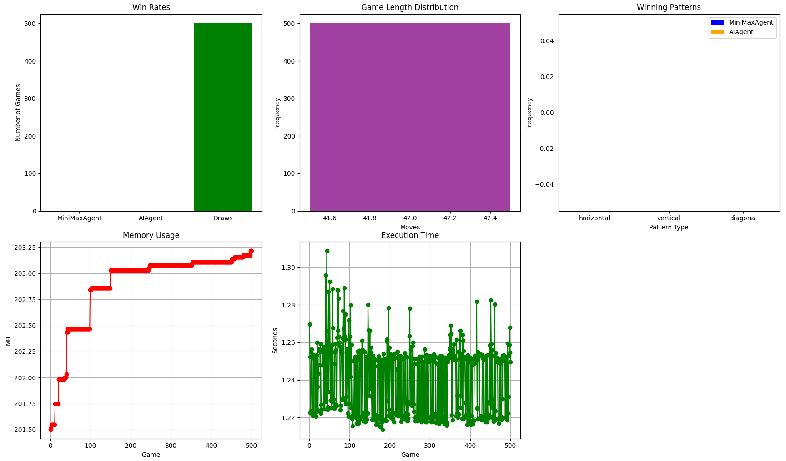

# Connect 4 AI Agents 🤖

Welcome to the **Connect 4 AI Agents** project! This repository contains a collection of AI agents designed to play the classic game of Connect 4. The agents range from simple random decision-makers to more advanced ones like the MiniMax and ML-based agents. Below, you'll find all the necessary information to get started, evaluate the agents, and even play against them!


## 🚀 Getting Started

To get started, clone this repository and ensure you have Python 3 installed. All commands should be executed from the **root directory** of the project.


### 🐍 Python Version and Virtual Environment

This project is developed and tested using **Python 3.12.8**. To ensure compatibility, it's recommended to use the same version in a virtual environment (`.venv`).


### 📦 Install Dependencies

First, install the required dependencies using pip:

```sh
pip install -r requirements.txt
```


### 🕹️ Play Against the AI

To play Connect 4 against one of the AI agents, run the following command:

```sh
python3 -m src.play_game
```


### 🧪 Run Tests

We have a suite of tests to ensure everything is working as expected. You can run the tests for each component as follows:

```sh
python3 -m src.test.test_game_board
python3 -m src.test.test_mini_max_agent
python3 -m src.test.test_ml_agent
python3 -m src.test.test_random_agent
python3 -m src.test.test_smart_agent
```


### 📊 Evaluation

To evaluate the performance of the AI agents, navigate to the `src/evaluation/evaluation.py` file. Uncomment the relevant lines for the evaluation you want to run, and then execute:

```sh
python3 -m src.evaluation
```

The evaluation results will include graphs and metrics to compare the agents' performance.


### 📈 Evaluation Graphs

Here are some key graphs generated during the evaluation:

1. **Training Loss for ML Agent**  
   

2. **Agent Performance Comparisons**  
**Random vs. Smart**  
     
**Smart vs. Minimax**  
     
**Minimax vs. ML**  
     


### 📚 Credits

For a list of resources, libraries, and tools used in this project, check out the `credits.md` file. It includes links and acknowledgments for everything that helped make this project possible.
